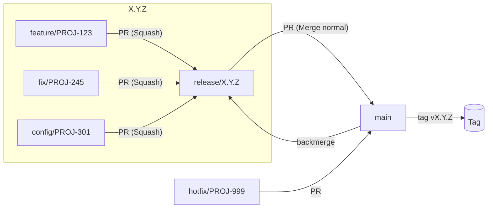

# Flujo de trabajo en GitHub

Este documento define nuestro flujo de ramas, PRs y releases para mantener una historia limpia, versiones trazables y despliegues previsibles.

> **Resumen:**  
> - Creamos una rama `release/X.Y.Z` al inicio de cada versión.  
> - Todas las tareas salen de esa `release/*`: `feature/ID`, `fix/ID`, `config/ID`, etc.  
> - Hacemos **Squash & Merge** en todos los PRs **excepto** `release → main`, que va con **Merge normal** para generar changelog y tag.  
> - Hotfix de producción: `hotfix/ID` desde `main`, luego **backmerge** a la `release` vigente.

---

## 🌳 Ramas

- **`main`** (protegida)  
  Estado de **producción**. Se actualiza solo desde:
  - PR **`release/X.Y.Z` → `main`** (Merge normal).
  - PR **`hotfix/ID` → `main`** (para incidencias críticas).

- **`release/X.Y.Z`** (protegida)  
  Rama de **preparación de versión**. Se crea **antes de empezar** la nueva versión.  
  De aquí salen todas las ramas de tarea y aquí se integran hasta estabilizar.

- **`feature/ID`**  
  Nueva funcionalidad no crítica. `ID` es el ID de Trello (p. ej. `PROJ-123`).  
  - Si una tarea es grande y tiene subtareas, se crean **múltiples** `feature/ID-sub` (p. ej. `feature/PROJ-123-a`, `feature/PROJ-123-b`), todas desde `release/X.Y.Z`.

- **`fix/ID`**  
  Correcciones no críticas (no producción). También salen de `release/X.Y.Z`.

- **`config/ID`**  
  Cambios en **ficheros de configuración** o similares (YAML, JSON, properties, pipelines, infra-as-code…) que no son hotfix.  
  También desde `release/X.Y.Z`.

- **`hotfix/ID`**  
  Incidencia **crítica** en producción. Se crea **desde `main`**, se mergea a `main` y luego **backmerge** a la `release/X.Y.Z` activa.

---

## 🧭 Flujo de trabajo por versión

### 1️⃣ Crear versión
```bash
git checkout main
git pull
git checkout -b release/X.Y.Z
git push -u origin release/X.Y.Z
```
Ejemplo: `X.Y.Z = 1.6.0`

---

### 2️⃣ Crear tareas desde la release
- **Feature**
  ```bash
  git checkout release/1.6.0
  git pull
  git checkout -b feature/PROJ-123
  ```
- **Fix**
  ```bash
  git checkout -b fix/PROJ-245
  ```
- **Config**
  ```bash
  git checkout -b config/PROJ-301
  ```

---

### 3️⃣ Pull Requests hacia `release/X.Y.Z`
- **Base:** `release/X.Y.Z`
- **Compare:** `feature/*`, `fix/*` o `config/*`
- **Regla:** usar **Squash & Merge** → un commit por tarea
- Tras el merge, borrar la rama de tarea

---

### 4️⃣ QA y estabilización en `release/X.Y.Z`
- Pruebas automáticas y manuales
- Validaciones de negocio
- Hardening y documentación

---

### 5️⃣ Publicar versión en `main`
Abrir PR `release/X.Y.Z → main` usando **Merge commit (Merge normal)**.  
Motivo: conservar el historial de commits para generar changelog y crear tag.

---

### 6️⃣ Crear tag y generar changelog
Tras mergear en `main`:
```bash
git checkout main
git pull
git tag -a vX.Y.Z -m "Release vX.Y.Z"
git push origin vX.Y.Z
```


---

## 🚑 Hotfix de producción

### 1️⃣ Crear hotfix desde `main`
```bash
git checkout main
git pull
git checkout -b hotfix/PROJ-999
```

---

### 2️⃣ Crear Pull Request
Abrir PR `hotfix/PROJ-999 → main`  
- Merge con **Squash & Merge** (si quieres un solo commit)  
- O **Merge normal** (si quieres mantener todos los commits)

---

### 3️⃣ Crear tag (opcional)
```bash
git tag -a vX.Y.Z+hotfix.1 -m "Hotfix vX.Y.Z+hotfix.1"
git push origin vX.Y.Z+hotfix.1
```

---

### 4️⃣ Backmerge a la release activa
```bash
git checkout release/X.Y.Z
git pull
git merge --no-ff main
git push
```

---

## 🔁 Estrategia de merge

- `Tareas` → `release/X.Y.Z`: Squash & Merge  
- `release/X.Y.Z` → `main`: Merge normal  
- `Backmerge`: siempre main → release/X.Y.Z tras hotfix.

---

## ✅ Reglas de protección

- `main` y `release/*`:
  - Requieren PR + al menos 1 review.  
  - Checks de CI obligatorios (build, tests, lint).  
  - Prohibir force-push.  
  - Requerir rama actualizada con base branch.  
  - Permitir solo Merge commit en PR release → main.

---

## 📦 Nomenclatura de ramas

- `Release: release/X.Y.Z`  
- `Feature: feature/<ID> o feature/<ID-sub>`  
- `Fix: fix/<ID>`  
- `Config: config/<ID>`  
- `Hotfix: hotfix/<ID>`  

---

## 🗺️ Diagrama (Mermaid)



---

## 🧰 Comandos útiles

# Actualizar tu rama de tarea con lo último de la release  
```bash
git fetch origin  
git rebase origin/release/X.Y.Z  
```

# Abortar un rebase 
```bash 
git rebase --abort  
```
